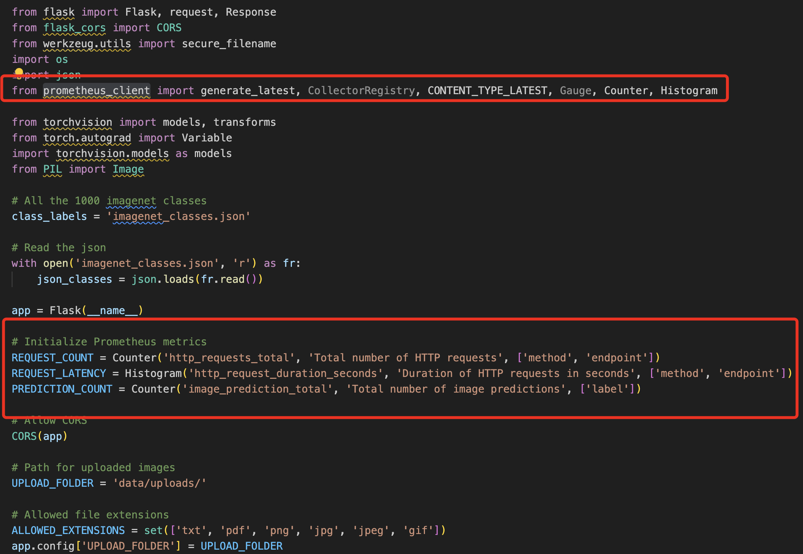

# DevOps Home Assignment - Dig Security

## Overview

task containes 6 main folders:
* .github/workflow : 
  contain the ci-cd yaml file:
- Build each container service - with the DOCKERFILE
- Deploy each image to the private registry - DOCKER-HUB
- Update the K8s cluster with new containers services - EKS or any other 

* application
  contain the backend\frontend code with the dockerfile used to containerize the app services

* charts
  contain an umbrella chart that made up of 3 helm charts:
  backend
  frontend
  postgresql

* ci-cd
  contain the github action yaml file - build/push/deploy

* terraform
  contains few basic tf files to deploy the all infrastructure:
  eks.tf - will create the eks cluster 
  helm.tf - another option that will deploy the helm charts using terraform

* private-docker-registry
  create a private-docker-registry with pvc to ensure the the images will persist after restart

usage:

run the terraform stack to create the eks cluster
run the ci-cd githb action to build/push and deploy the helm charts to the eks cluster
or
run manualy 
helm install dig . -n dig from the charts folder

## Task details

1. K8s cluster
Create a Kubernetes cluster with your preferred method (EKS is the best option) To hold the application services
Create a YAML for each of the application services.